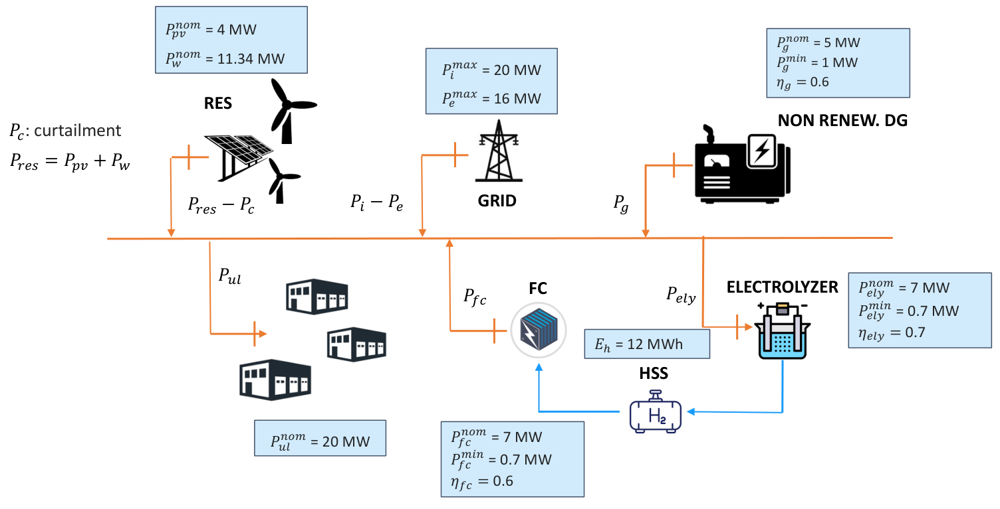

# Report Finale - Project 4: Sistema Energetico Integrato con Idrogeno

---

## 1. Scopo del progetto

Progettare un sistema di ottimizzazione/controllo (MPC - Model Predictive Control) per un sistema energetico integrato che include:
- Fonti rinnovabili (PV + Wind)
- Carico elettrico non controllabile
- Sistema di stoccaggio a idrogeno (elettrolizzatore + storage + fuel cell)
- Generatore diesel di backup (DG)
- Scambio bidirezionale con la rete elettrica

**Obiettivi di ottimizzazione:**
- a) Minimizzare il costo / massimizzare il ricavo
- b) Soddisfare sempre il carico
- c) Minimizzare il curtailment delle rinnovabili

---

## 2. Schema del sistema



### Componenti e parametri tecnici

| Componente | Parametro | Valore | Unita |
|------------|-----------|--------|-------|
| **Fotovoltaico (PV)** | Potenza nominale | 4.0 | MW |
| **Eolico (Wind)** | Potenza nominale | 11.34 | MW |
| **Carico (Pul)** | Potenza nominale | 20 | MW |
| **Rete - Import** | Potenza massima | 20.0 | MW |
| **Rete - Export** | Potenza massima | 16.0 | MW |
| **Elettrolizzatore (ELY)** | Potenza nominale | 7.0 | MW |
| **Elettrolizzatore (ELY)** | Potenza minima | 0.7 | MW |
| **Elettrolizzatore (ELY)** | Efficienza | 70% | - |
| **Fuel Cell (FC)** | Potenza nominale | 7.0 | MW |
| **Fuel Cell (FC)** | Potenza minima | 0.7 | MW |
| **Fuel Cell (FC)** | Efficienza | 60% | - |
| **Storage H2 (HSS)** | Capacita | 12.0 | MWh |
| **Generatore Diesel (DG)** | Potenza nominale | 5.0 | MW |
| **Generatore Diesel (DG)** | Potenza minima | 1.0 | MW |
| **Generatore Diesel (DG)** | Efficienza | 60% | - |

---

## 3. Metodologia: MPC Rolling Horizon

### 3.1 Cos'e il Model Predictive Control (MPC)

Il MPC e una strategia di controllo che ripete ciclicamente 4 step:

```
STEP 1: Raccogli previsioni (PV, Wind, Load, Prezzi) per le prossime 24 ore
           |
           v
STEP 2: Risolvi il problema di ottimizzazione MILP sull'orizzonte di 24h
           |
           v
STEP 3: Applica SOLO la prima decisione (ora corrente)
           |
           v
STEP 4: Avanza di 1 ora e torna a STEP 1
```

### 3.2 Perche MILP e non LP?

Il modello usa **MILP (Mixed Integer Linear Programming)** invece di LP puro per rispettare i vincoli di potenza minima:

| Componente | Vincolo | Comportamento |
|------------|---------|---------------|
| ELY | P_min = 0.7 MW | O spento (0 MW) O acceso (0.7-7 MW) |
| FC | P_min = 0.7 MW | O spenta (0 MW) O accesa (0.7-7 MW) |
| DG | P_min = 1.0 MW | O spento (0 MW) O acceso (1-5 MW) |

Le variabili binarie (u_ely, u_fc, u_dg) permettono di modellare correttamente questo comportamento on/off.

### 3.3 Bilancio energetico

Il vincolo fondamentale e che **tutta l'energia IN = tutta l'energia OUT**:

```
ENERGIA IN                      ENERGIA OUT
-----------                     -----------
P_pv                            P_load
P_wind          ===             P_export
P_import                        P_ely
P_dg                            P_curtail
P_fc
```

Formula:
```
P_pv + P_wind + P_import + P_dg + P_fc = P_load + P_export + P_ely + P_curt
```

---

## 4. Prezzi e tariffe utilizzati

### 4.1 Costo energia importata (tariffe ARERA)

| Fascia | Orario | Prezzo (EUR/kWh) | Prezzo (EUR/MWh) |
|--------|--------|------------------|------------------|
| **F1** | Lun-Ven 08:00-19:00 | 0.53276 | 532.76 |
| **F2** | Lun-Ven 07-08, 19-23; Sab 07-23 | 0.54858 | 548.58 |
| **F3** | Notti, domeniche, festivita | 0.46868 | 468.68 |
| **Media ponderata** | - | ~0.515 | ~515 |

### 4.2 Prezzo energia esportata (PUN)

- **PUN 2022**: Prezzo Unico Nazionale, varia ora per ora
- Range: 10 - 870 EUR/MWh
- Media annuale: ~304 EUR/MWh

#### Analisi statistica del PUN 2022

| Soglia | Ore | % del totale |
|--------|-----|--------------|
| PUN > 750 EUR/MWh | 47 ore | 0.54% |
| PUN > 700 EUR/MWh | 90 ore | 1.03% |
| PUN > 600 EUR/MWh | 315 ore | 3.60% |
| PUN > 500 EUR/MWh | 816 ore | 9.32% |

**Statistiche PUN 2022:**
- Minimo: 10 EUR/MWh
- Massimo: 870 EUR/MWh
- Media: 304 EUR/MWh

**Perche il DG e usato 39 ore e non 47?**

Le 47 ore con PUN > 750 sono nel dataset completo (8760 ore), ma noi simuliamo solo **6528 ore** (limitate dal file buildings_load.mat). Inoltre, anche quando PUN > 750, il DG si usa solo se conviene nel contesto dell'ottimizzazione (bilancio energetico, stato storage H2, ecc.).

Le ore con PUN alto sono concentrate ad **agosto 2022** (ore 5634-5800), periodo di crisi energetica in Europa.

### 4.3 Costo carburante DG (scenari testati)

| Scenario | Costo carburante | Costo elettrico* | Confronto con rete |
|----------|------------------|------------------|-------------------|
| **cf = 0.45** | 0.45 EUR/kWh | 750 EUR/MWh | +46% vs import |
| **cf = 0.60** | 0.60 EUR/kWh | 1000 EUR/MWh | +94% vs import |

*Costo elettrico = costo_carburante / efficienza_DG = cf / 0.6

---

## 5. Strategia di controllo ottimale: decisioni ora per ora

### 5.1 Logica decisionale

Per ogni ora, il sistema decide la configurazione ottimale seguendo questa logica:

```
                    +------------------+
                    |  Calcola deficit |
                    |  o surplus RES   |
                    +--------+---------+
                             |
              +--------------+--------------+
              |                             |
        SURPLUS (RES > Load)          DEFICIT (RES < Load)
              |                             |
    +---------+---------+         +---------+---------+
    |                   |         |                   |
    v                   v         v                   v
Export a PUN?     Carica H2?   Scarica H2?      Import rete?
(se PUN alto)     (se SOC<max) (se SOC>0)       (se <20MW)
    |                   |         |                   |
    +-------------------+         +-------------------+
              |                             |
              v                             v
    Se ancora surplus:              Se ancora deficit:
    -> CURTAILMENT                  -> USA DG (se PUN>750)
```

### 5.2 Arbitraggio sui prezzi

Il sistema puo fare **arbitraggio** quando i prezzi lo permettono:

**Esempio ora 5694 (cf=0.45):**
```
Prezzi:
  - Import ARERA: 468.68 EUR/MWh
  - Export PUN:   769.12 EUR/MWh  (molto alto!)
  - Costo DG:     750.00 EUR/MWh

Decisione ottimale:
  - Import:  20.00 MW (massimo)
  - DG:       5.00 MW (massimo)
  - Export:  14.46 MW
  - Load:    10.87 MW

Bilancio: 20 + 5 + 0.33(RES) = 10.87 + 14.46 = 25.33 MW  [OK]

Profitto arbitraggio:
  - Compro 20 MW a 468.68 = 9,374 EUR (costo)
  - Vendo 14.46 MW a 769.12 = 11,122 EUR (ricavo)
  - DG 5 MW a 750 = 3,750 EUR (costo)
  - Netto: 11,122 - 9,374 - 3,750 = -2,002 EUR

Ma il sistema copre anche il carico di 10.87 MW!
```

**Quando conviene usare il DG per arbitraggio:**
```
PUN > Costo_DG  =>  PUN > 750 EUR/MWh (cf=0.45)
                    PUN > 1000 EUR/MWh (cf=0.60, mai raggiunto)
```

### 5.3 Strategie identificate

Analisi delle 6528 ore simulate:

| Strategia | cf=0.45 | cf=0.60 | Descrizione |
|-----------|--------:|--------:|-------------|
| IMPORT | 5438 | 5439 | Solo import dalla rete |
| IMPORT+EXPORT | 680 | 719 | Import + export (arbitraggio base) |
| EXPORT | 236 | 239 | Solo export (surplus RES) |
| ELY | 56 | 52 | Carica storage H2 |
| **IMPORT+EXPORT+DG** | **39** | **0** | Arbitraggio con DG |
| RES | 35 | 35 | Solo rinnovabili |
| IMPORT+FC | 34 | 33 | Scarica storage H2 |
| Altre | 10 | 11 | Combinazioni varie |

**Osservazione chiave:** Con cf=0.60 il DG non viene MAI usato (costo troppo alto).

---

## 6. Risultati delle simulazioni

### 6.1 Riepilogo scenari

Periodo simulato: **6528 ore** con MPC rolling horizon (orizzonte 24h)

| Voce | cf=0.45 | cf=0.60 | Differenza |
|------|--------:|--------:|------------|
| **ENERGIA** ||||
| Energia carico (MWh) | 47,650.79 | 47,650.79 | 0 |
| Energia PV (MWh) | 5,434.80 | 5,434.80 | 0 |
| Energia Wind (MWh) | 6,411.43 | 6,411.43 | 0 |
| Energia Import (MWh) | 46,050.71 | 46,052.37 | +0.004% |
| Energia Export (MWh) | 10,127.95 | 10,003.06 | -1.2% |
| **Energia DG (MWh)** | **128.76** | **0.00** | **-100%** |
| **SISTEMA H2** ||||
| Energia ELY (MWh) | 119.40 | 115.58 | -3.2% |
| Energia FC (MWh) | 50.15 | 48.54 | -3.2% |
| H2 prodotto (MWh) | 83.58 | 80.91 | -3.2% |
| **COSTI** ||||
| Costo Import (EUR) | 23,417,554 | 23,418,483 | +0.004% |
| Ricavo Export (EUR) | 5,986,768 | 5,885,006 | -1.7% |
| Costo DG (EUR) | 96,566 | 0 | -100% |
| **COSTO NETTO (EUR)** | **17,527,353** | **17,533,477** | **+0.03%** |

### 6.2 Breakdown costi

**cf=0.45:**
```
Costo Import:      +23,417,554 EUR  (99.6%)
Costo DG:              +96,566 EUR   (0.4%)
Ricavo Export:      -5,986,768 EUR (-25.5%)
---------------------------------------------
COSTO NETTO:       17,527,353 EUR
Costo per MWh:     367.83 EUR/MWh
```

**cf=0.60:**
```
Costo Import:      +23,418,483 EUR (100.0%)
Costo DG:                    0 EUR   (0.0%)
Ricavo Export:      -5,885,006 EUR (-25.1%)
---------------------------------------------
COSTO NETTO:       17,533,477 EUR
Costo per MWh:     367.96 EUR/MWh
```

---

## 7. Analisi economica: quando conviene ogni componente

### 7.1 Generatore Diesel (DG)

| Condizione | cf=0.45 | cf=0.60 |
|------------|---------|---------|
| Costo DG | 750 EUR/MWh | 1000 EUR/MWh |
| PUN max 2022 | 870 EUR/MWh | 870 EUR/MWh |
| **Conviene arbitraggio?** | **Si, se PUN > 750** | **No, mai** |
| Ore con DG attivo | 39 | 0 |

**Conclusione DG:**
- Con cf=0.45: usato SOLO per arbitraggio quando PUN e molto alto (>750)
- Con cf=0.60: MAI conveniente (costo 1000 > PUN max 870)
- Il DG e marginale nel mix energetico (<0.3% dell'energia)

### 7.2 Sistema Idrogeno (ELY + FC)

| Metrica | Valore |
|---------|--------|
| Efficienza ELY | 70% |
| Efficienza FC | 60% |
| **Efficienza round-trip** | **42%** |
| Energia persa per ciclo | 58% |

**Quando conviene usare H2:**
```
Carica (ELY): quando c'e surplus RES e SOC < 100%
Scarica (FC): quando c'e deficit e SOC > 0% e Import al massimo
```

L'efficienza del 42% lo rende utile solo per:
- Energy shifting (spostare energia nel tempo)
- Evitare curtailment
- NON per arbitraggio puro (troppe perdite)

### 7.3 Import/Export rete

| Operazione | Condizione | Prezzo |
|------------|------------|--------|
| Import | Sempre disponibile | 469-549 EUR/MWh (ARERA) |
| Export | Surplus disponibile | PUN variabile (10-870) |

**Arbitraggio import/export:**
- Sempre possibile perche il bilancio IN=OUT e rispettato
- Conveniente quando PUN > costo import
- Il sistema puo comprare E vendere contemporaneamente

---

## 8. Decisioni ora per ora

### 8.1 File generato

Il file `outputs/DECISIONI_ORA_PER_ORA.csv` contiene per ogni ora:

| Colonna | Descrizione |
|---------|-------------|
| datetime | Data e ora |
| load_MW | Carico da soddisfare |
| pv_MW, wind_MW | Produzione rinnovabili |
| import_price, export_price | Prezzi correnti |
| cf045_import_MW | Potenza importata (cf=0.45) |
| cf045_export_MW | Potenza esportata (cf=0.45) |
| cf045_DG_MW | Potenza DG (cf=0.45) |
| cf045_ELY_MW | Potenza elettrolizzatore (cf=0.45) |
| cf045_FC_MW | Potenza fuel cell (cf=0.45) |
| cf045_H2_SOC_MWh | Stato storage H2 (cf=0.45) |
| cf060_* | Stessi campi per cf=0.60 |

### 8.2 Come leggere le decisioni

Per ogni ora, controlla i valori:

```
SE import_MW > 0    -> Compra dalla rete
SE export_MW > 0    -> Vendi alla rete
SE DG_MW > 0        -> Accendi il diesel (solo cf=0.45, PUN alto)
SE ELY_MW > 0       -> Carica storage H2 (surplus RES)
SE FC_MW > 0        -> Scarica storage H2 (deficit)
```

### 8.3 Esempi pratici

**Ora tipica - deficit (ora 15):**
```
Load: 18.21 MW, PV: 0.42 MW, Wind: 0 MW
Decisione: IMPORT 17.79 MW
```

**Ora con surplus RES (ora 34):**
```
Load: 9.29 MW, PV: 1.04 MW, Wind: 9.53 MW
RES totale: 10.57 MW > Load
Decisione: ELY 1.28 MW (carica H2)
```

**Ora con arbitraggio DG (ora 5694, cf=0.45):**
```
PUN: 769.12 EUR/MWh (molto alto!)
Import: 20 MW, DG: 5 MW, Export: 14.46 MW
Profitto: vendita a PUN alto usando DG
```

---

## 9. Conclusioni e raccomandazioni

### 9.1 Sintesi risultati

1. **Il DG non conviene quasi mai**
   - Con cf=0.45: usato solo 39 ore su 6528 (0.6%) per arbitraggio
   - Con cf=0.60: MAI usato
   - Impatto sul costo totale: < 0.5%

2. **L'arbitraggio e la chiave**
   - Import + Export contemporanei sono ottimali
   - Il DG si usa solo quando PUN > 750 EUR/MWh
   - Il bilancio IN = OUT e sempre rispettato

3. **Lo storage H2 ha uso limitato**
   - Efficienza round-trip 42% (perdite elevate)
   - Utile solo per energy shifting, non per arbitraggio

4. **La rete e la fonte principale**
   - Import copre ~97% del fabbisogno
   - Export genera ~25% di ricavo sui costi

### 9.2 Raccomandazioni operative

| Componente | Raccomandazione |
|------------|-----------------|
| **DG** | Usare SOLO se PUN > 750 EUR/MWh (raro) |
| **ELY** | Attivare quando surplus RES e SOC < 100% |
| **FC** | Attivare quando deficit e import al max |
| **Import** | Fonte principale, sempre conveniente |
| **Export** | Vendere tutto il surplus possibile |

### 9.3 Differenza tra scenari

La differenza tra cf=0.45 e cf=0.60 e **minima** (+0.03% costo):
- Il parametro cf ha impatto solo quando si usa il DG
- Con cf=0.60 il DG non si usa mai
- Il sistema compensa con piu import dalla rete

---

## 10. Appendice tecnica

### 10.1 File di output

| File | Descrizione |
|------|-------------|
| `outputs/mpc_receding_cf045.csv` | Schedule MPC completo (cf=0.45) |
| `outputs/mpc_receding_cf060.csv` | Schedule MPC completo (cf=0.60) |
| `outputs/DECISIONI_ORA_PER_ORA.csv` | Confronto decisioni ora per ora |
| `outputs/report_cf045.csv` | Metriche aggregate |
| `outputs/report_cf060.csv` | Metriche aggregate |
| `outputs/plots/*.png` | Grafici risultati |

### 10.2 Come riprodurre i risultati

```bash
# Installare dipendenze
pip install -r requirements.txt

# Eseguire MPC (genera schedule per entrambi gli scenari)
python src/run_mpc_full.py --horizon 24 --fuel-values 0.45,0.60

# Generare report
python src/report.py --schedule outputs/mpc_receding_cf045.csv --out outputs/report_cf045.csv --fuel-cost 0.45 --plots
python src/report.py --schedule outputs/mpc_receding_cf060.csv --out outputs/report_cf060.csv --fuel-cost 0.60

# Generare grafici dettagliati
python src/plot_results.py --hours 168 --start 0
```

### 10.3 Formule del modello

**Bilancio energetico:**
```
P_pv + P_wind + P_import + P_dg + P_fc = P_load + P_ely + P_export + P_curt
```

**Dinamica storage H2:**
```
SOC(t+1) = SOC(t) + dt * (eta_ely * P_ely - P_fc / eta_fc)
```

**Funzione obiettivo:**
```
min: sum( c_import * P_import - PUN * P_export + (c_fuel/eta_dg) * P_dg + lambda * P_curt )
```

**Vincoli on/off (MILP):**
```
P_ely <= P_ely_nom * u_ely
P_ely >= P_ely_min * u_ely
(analogo per FC e DG)
```

---

## 11. Come estendere il modello (guida per sviluppatori)

### 11.1 Struttura del codice

```
src/
├── model.py          <- MODELLO MPC (variabili, vincoli, obiettivo)
├── run_mpc_full.py   <- LOOP MPC (rolling horizon)
├── loader.py         <- Caricamento dati
├── tariff.py         <- Tariffe ARERA
├── report.py         <- Generazione report
└── plot_results.py   <- Grafici

configs/
└── system.yaml       <- PARAMETRI (potenze, efficienze, prezzi)
```

### 11.2 Dove aggiungere una nuova VARIABILE DECISIONALE

**File: `src/model.py`**

**STEP 1 - Dichiarare la variabile (linea ~158-168):**
```python
# Esempio: aggiungere una batteria
p_battery_ch = cp.Variable(horizon_h, nonneg=True)   # Carica batteria
p_battery_dis = cp.Variable(horizon_h, nonneg=True)  # Scarica batteria
u_battery = cp.Variable(horizon_h, boolean=True)     # On/off (opzionale)
soc_battery = cp.Variable(horizon_h + 1)             # Stato di carica
```

**STEP 2 - Aggiungere i vincoli (linea ~172-194):**
```python
# Limiti potenza
constraints += [p_battery_ch <= float(sys['battery_nom_mw'])]
constraints += [p_battery_dis <= float(sys['battery_nom_mw'])]

# Limiti SOC
constraints += [soc_battery >= 0.0]
constraints += [soc_battery <= float(sys['battery_capacity_mwh'])]

# Condizione iniziale
constraints += [soc_battery[0] == soc_battery_init]

# Dinamica batteria
constraints += [
    soc_battery[1:] == soc_battery[:-1] + dt * (
        eta_ch * p_battery_ch - p_battery_dis / eta_dis
    )
]

# Mutua esclusione carica/scarica (opzionale)
constraints += [p_battery_ch + p_battery_dis <= float(sys['battery_nom_mw']) * u_battery]
```

**STEP 3 - Aggiornare il bilancio energetico (linea ~186-189):**
```python
constraints += [
    pv + wind + p_import + p_dg + p_fc + p_battery_dis  # <- AGGIUNTO
    == load + p_ely + p_export + p_curt + p_battery_ch  # <- AGGIUNTO
]
```

**STEP 4 - Aggiornare la funzione obiettivo (linea ~199-202):**
```python
# Se la batteria ha un costo di degradazione:
cost += degradation_cost * cp.sum(p_battery_ch + p_battery_dis) * dt
```

**STEP 5 - Aggiungere al DataFrame di output (linea ~211-222):**
```python
schedule = pd.DataFrame({
    # ... variabili esistenti ...
    'p_battery_ch_mw': p_battery_ch.value,
    'p_battery_dis_mw': p_battery_dis.value,
    'soc_battery_mwh': soc_battery.value[1:],
})
```

### 11.3 Dove aggiungere un nuovo PARAMETRO

**File: `configs/system.yaml`**

```yaml
system:
  # ... parametri esistenti ...

  # Nuova batteria
  battery_nom_mw: 10.0
  battery_capacity_mwh: 40.0
  eta_battery_ch: 0.95
  eta_battery_dis: 0.95
```

**File: `src/model.py` - leggere il parametro:**
```python
battery_cap = float(sys['battery_capacity_mwh'])
eta_ch = float(sys['eta_battery_ch'])
eta_dis = float(sys['eta_battery_dis'])
```

### 11.4 Dove aggiungere un nuovo VINCOLO

**File: `src/model.py` (linea ~172-194)**

Esempi di vincoli comuni:

```python
# Vincolo rampa (variazione massima tra ore)
constraints += [cp.abs(p_dg[1:] - p_dg[:-1]) <= ramp_rate_mw]

# Vincolo mutua esclusione import/export
constraints += [p_import * p_export == 0]  # Non lineare! Usare binarie:
constraints += [p_import <= M * (1 - u_export)]
constraints += [p_export <= M * u_export]

# Vincolo minimo tempo accensione (DG acceso per almeno 3 ore)
for t in range(horizon_h - 2):
    constraints += [u_dg[t+1] + u_dg[t+2] >= 2 * (u_dg[t+1] - u_dg[t])]

# Vincolo SOC finale = SOC iniziale (ciclo completo)
constraints += [soc[-1] == soc[0]]
```

### 11.5 Dove modificare il LOOP MPC

**File: `src/run_mpc_full.py` (linea ~19-48)**

```python
def run_receding(...):
    results = []
    soc = 0.0                    # <- Stato iniziale H2
    soc_battery = 0.5            # <- Aggiungere stato iniziale batteria

    for hour in tqdm(...):
        res = solve_horizon(
            df, cfg, hour, horizon,
            soc,
            soc_battery,         # <- Passare nuovo stato
            fuel_eur_per_kwh=fuel_eur_per_kwh
        )

        first = res.schedule.iloc[0]
        soc = float(first['soc_mwh'])
        soc_battery = float(first['soc_battery_mwh'])  # <- Aggiornare

        results.append({
            # ... campi esistenti ...
            'soc_battery_mwh': soc_battery,  # <- Aggiungere output
        })
```

---

## 12. Teoria MPC per l'esame

### 12.1 Cos'e il Model Predictive Control?

Il **MPC (Model Predictive Control)** e una strategia di controllo ottimo che:

1. **Predice** il comportamento futuro del sistema su un orizzonte finito
2. **Ottimizza** le azioni future minimizzando una funzione costo
3. **Applica** solo la prima azione ottimale
4. **Ripete** il processo ad ogni passo temporale

### 12.2 Vantaggi del MPC

| Vantaggio | Spiegazione |
|-----------|-------------|
| **Gestisce vincoli** | Limiti fisici (potenza max, SOC min/max) |
| **Anticipa il futuro** | Usa previsioni per decisioni migliori |
| **Adattivo** | Si aggiorna ad ogni passo con nuove informazioni |
| **Multi-obiettivo** | Bilancia costi, emissioni, comfort |

### 12.3 Svantaggi del MPC

| Svantaggio | Spiegazione |
|------------|-------------|
| **Computazionalmente costoso** | Risolve ottimizzazione ad ogni passo |
| **Dipende da previsioni** | Errori di forecast degradano le prestazioni |
| **Tuning parametri** | Orizzonte, pesi obiettivo richiedono taratura |

### 12.4 Differenza tra MPC e controllo classico

| Aspetto | Controllo PID | MPC |
|---------|---------------|-----|
| Orizzonte | Istantaneo | Futuro (24h) |
| Vincoli | Difficili da gestire | Nativamente supportati |
| Modello | Non richiesto | Richiesto |
| Ottimalita | Locale | Globale (sull'orizzonte) |

### 12.5 Formulazione matematica

**Problema di ottimizzazione ad ogni passo k:**

```
min    J = sum_{t=0}^{N-1} [ c_import(t)*P_import(t) - PUN(t)*P_export(t)
 u(t)                        + c_fuel/eta_dg * P_dg(t) + lambda*P_curt(t) ]

s.t.   P_pv(t) + P_wind(t) + P_import(t) + P_dg(t) + P_fc(t)
       = P_load(t) + P_export(t) + P_ely(t) + P_curt(t)     [bilancio]

       SOC(t+1) = SOC(t) + dt*(eta_ely*P_ely(t) - P_fc(t)/eta_fc)  [dinamica]

       0 <= P_import(t) <= P_import_max                      [limiti]
       0 <= P_export(t) <= P_export_max
       P_ely_min * u_ely(t) <= P_ely(t) <= P_ely_max * u_ely(t)
       ...

       u_ely(t), u_fc(t), u_dg(t) in {0,1}                   [binarie]
```

Dove:
- **N** = orizzonte di previsione (24 ore)
- **u(t)** = variabili decisionali (P_import, P_export, P_ely, P_fc, P_dg)
- **J** = funzione obiettivo (costo da minimizzare)

---

## 13. Domande frequenti per l'esame

### 13.1 Domande sulla metodologia

**D: Perche si applica solo la prima decisione?**
> Perche le previsioni diventano meno accurate nel futuro. Applicando solo la prima decisione e ricalcolando, si usano sempre le previsioni piu aggiornate.

**D: Cosa succede se le previsioni sono sbagliate?**
> Il MPC e robusto agli errori grazie al feedback: ad ogni passo si ricalcola con i dati reali aggiornati. Errori grandi possono comunque degradare le prestazioni.

**D: Perche l'orizzonte e 24 ore?**
> Bilancia tra:
> - Vedere abbastanza avanti per anticipare i picchi di prezzo/carico
> - Non troppo avanti dove le previsioni sono inaffidabili
> - Tempo di calcolo ragionevole

**D: Perche MILP e non LP?**
> I vincoli di potenza minima (P_ely >= 0.7 MW quando acceso) richiedono variabili binarie. Con LP puro, l'elettrolizzatore potrebbe funzionare a 0.1 MW, irrealistico.

### 13.2 Domande sui risultati

**D: Perche il DG non viene quasi mai usato?**
> Perche il costo del DG (750-1000 EUR/MWh) e sempre maggiore dell'import dalla rete (~515 EUR/MWh). Conviene solo per arbitraggio quando PUN > 750.

**D: Perche import e export possono essere contemporanei?**
> Il sistema fa arbitraggio: compra a prezzo basso (ARERA) e vende a prezzo alto (PUN). Il bilancio energetico IN=OUT e sempre rispettato.

**D: Perche lo storage H2 e poco usato?**
> L'efficienza round-trip e solo 42% (= 0.7 * 0.6). Si perde il 58% dell'energia. Conviene solo per energy shifting, non per arbitraggio.

**D: Qual e l'impatto del parametro cf?**
> Con cf=0.45 il DG costa 750 EUR/MWh, usato 39 ore.
> Con cf=0.60 il DG costa 1000 EUR/MWh, MAI usato.
> La differenza sul costo totale e solo +0.03%.

### 13.3 Domande sul codice

**D: Come si aggiunge una nuova variabile?**
> Vedi Sezione 11.2 - modificare `model.py` in 5 punti: dichiarazione, vincoli, bilancio, obiettivo, output.

**D: Dove sono definiti i parametri?**
> In `configs/system.yaml` - potenze nominali, efficienze, prezzi.

**D: Come si cambia l'orizzonte MPC?**
> Parametro `horizon_h` in `configs/system.yaml` oppure argomento `--horizon` da linea di comando.

---

## 14. Glossario dei termini

| Termine | Significato |
|---------|-------------|
| **MPC** | Model Predictive Control - controllo predittivo basato su modello |
| **MILP** | Mixed Integer Linear Programming - ottimizzazione con variabili intere e continue |
| **LP** | Linear Programming - ottimizzazione lineare (solo variabili continue) |
| **Rolling Horizon** | Orizzonte mobile - ripetere l'ottimizzazione ad ogni passo |
| **SOC** | State of Charge - stato di carica dello storage (0-100%) |
| **PUN** | Prezzo Unico Nazionale - prezzo energia all'ingrosso in Italia |
| **ARERA** | Autorita di Regolazione per Energia Reti e Ambiente |
| **F1/F2/F3** | Fasce orarie tariffarie italiane (punta/intermedia/fuori punta) |
| **ELY** | Elettrolizzatore - produce H2 da elettricita |
| **FC** | Fuel Cell - produce elettricita da H2 |
| **DG** | Diesel Generator - generatore a combustibile fossile |
| **RES** | Renewable Energy Sources - fonti rinnovabili (PV + Wind) |
| **Curtailment** | Taglio della produzione rinnovabile (energia sprecata) |
| **Arbitraggio** | Comprare a prezzo basso e vendere a prezzo alto |
| **Round-trip efficiency** | Efficienza ciclo completo (carica + scarica) |
| **Big-M** | Tecnica per linearizzare vincoli con variabili binarie |

---

## 15. Checklist per l'esame

### 15.1 Concetti da sapere spiegare

- [ ] Cos'e il MPC e come funziona (4 step)
- [ ] Differenza tra MILP e LP
- [ ] Perche servono variabili binarie
- [ ] Come si scrive il bilancio energetico
- [ ] Come funziona la dinamica dello storage
- [ ] Cosa rappresenta la funzione obiettivo
- [ ] Perche si usa rolling horizon
- [ ] Come interpretare i risultati

### 15.2 Formule da conoscere

```
Bilancio:   P_pv + P_wind + P_import + P_dg + P_fc = P_load + P_ely + P_export + P_curt

Dinamica:   SOC(t+1) = SOC(t) + dt * (eta_ely * P_ely - P_fc / eta_fc)

Obiettivo:  min sum( c_import*P_import - PUN*P_export + (c_fuel/eta_dg)*P_dg )

Vincolo on/off:  P_min * u <= P <= P_max * u,  u in {0,1}
```

### 15.3 Numeri chiave del progetto

| Parametro | Valore |
|-----------|--------|
| Potenza PV | 4 MW |
| Potenza Wind | 11.34 MW |
| Carico nominale | 20 MW |
| Import max | 20 MW |
| Export max | 16 MW |
| Storage H2 | 12 MWh |
| Efficienza ELY | 70% |
| Efficienza FC | 60% |
| Efficienza DG | 60% |
| Orizzonte MPC | 24 ore |
| Ore simulate | 6528 |
| Costo netto | ~17.5 M EUR |

---

*Report generato il 2026-01-27*
*Progetto: UCBM - Project 4 - Sistema Energetico con Idrogeno*
*Metodologia: MPC Rolling Horizon con ottimizzazione MILP*
